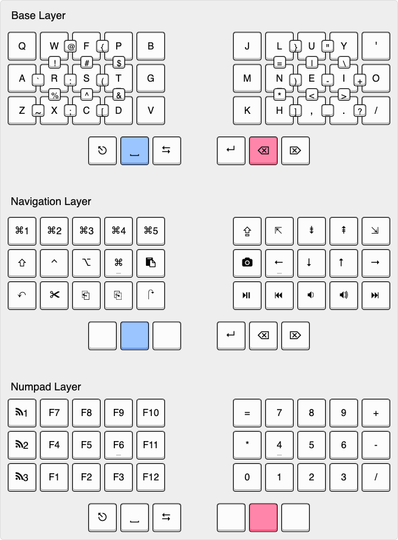

# Keymap

A combo-infused keymap for various QMK & ZMK boards, including: OLKB Planck v6, Boardsource Equals 48, Corne-ish Zen 3x5, and Ferris Sweep

[Link to keyboard-layout-editor](http://www.keyboard-layout-editor.com/#/gists/39d751b9dc2e97a37b8e29fe4aa87cc5)

## Features

The keymap has the following benefits:

- 36 key optimized (34 on [Sweep](./sweep/cradio.keymap))
- Colemak DHm base layer
- Convenient combos for symbols
- Home-row modifiers on both hands
- Macros for quickly taking a screenshot/viewing clipboard history (Alfred)
- Useful CAPSWORD instead of useless CAPSLOCK
- Only three total layers!

## Inspiration

Ideas for this keymap were drawn from the below resources:

- [Colemak Mod-DH](https://colemakmods.github.io/mod-dh/)
- [The Miryoku layout](https://github.com/manna-harbour/qmk_firmware/tree/miryoku/users/manna-harbour_miryoku)
- [Skychil's Kombol layout](https://github.com/skychil/kombol)
- [Jonas Hietala's T-34 layout](https://www.jonashietala.se/blog/2021/06/03/the-t-34-keyboard-layout/)
- [Precondition's home row mods writeup](https://precondition.github.io/home-row-mods)
- [gBoard's combo library](http://combos.gboards.ca/docs/install/)
